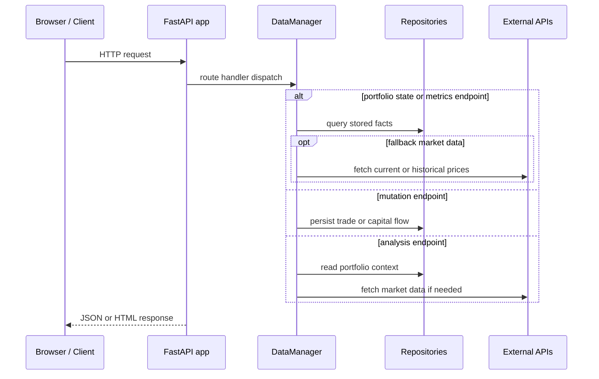

# API Functionality Diagram

```mermaid
flowchart TD
    Root["GET /"] --> Frontend["Serve frontend/index.html"]

    Summary["GET /api/portfolio/summary"] --> PV["DataManager.get_portfolio_value()"]
    Metrics["GET /api/portfolio/asset-metrics"] --> AM["DataManager.compute_asset_metrics(days)"]
    Curve["GET /api/portfolio/equity-curve"] --> EC["DataManager.compute_equity_curve(days)"]
    Performance["GET /api/portfolio/performance"] --> PM["DataManager.calculate_performance_metrics(period)"]

    Positions["GET /api/positions"] --> OP["DataManager.get_open_positions()"]
    TradesRead["GET /api/trades"] --> TH["PortfolioRepository.get_trade_history(days, symbol)"]

    TradesWrite["POST /api/trades"] --> Action{"BUY or SELL"}
    Action --> Buy["DataManager.record_buy(...)"]
    Action --> Sell["DataManager.record_sell(...)"]

    Deposit["POST /api/deposit"] --> RD["DataManager.record_deposit(...)"]
    Withdraw["POST /api/withdraw"] --> RW["DataManager.record_withdrawal(...)"]
    Analyze["POST /api/analysis/{symbol}"] --> AS["DataManager.analyze_stock(symbol)"]
```

## Request flow

## Endpoint groups

- Portfolio read endpoints: summary, asset metrics, equity curve, performance, positions, trades
- Portfolio write endpoints: deposit, withdraw, trades
- Analysis endpoint: on-demand AI analysis for a symbol
- Frontend entrypoint: root HTML plus mounted static assets
