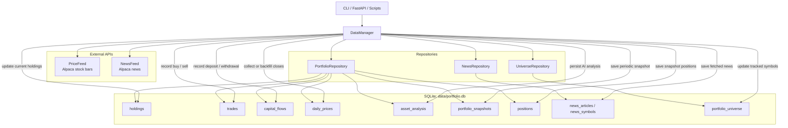
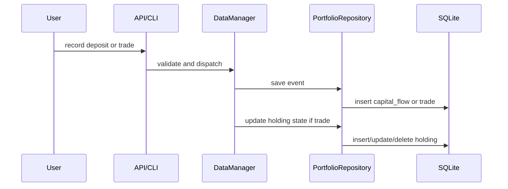
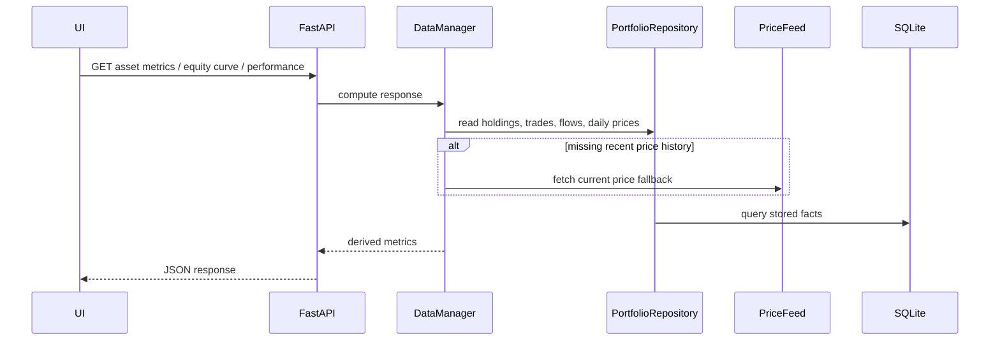

# Data Architecture

## Runtime responsibilities

### `DataManager`

- Orchestrates reads and writes across the application
- Computes asset metrics, equity curve, and performance
- Coordinates price collection and analysis persistence

### `PortfolioRepository`

- Owns current holdings, trades, cash flows, daily prices, snapshots, and analysis storage

### `NewsRepository`

- Stores and queries normalized news article data and symbol links

### `UniverseRepository`

- Tracks current, historical, and watchlist symbols

## Primary data flows

### Transaction flow

### Metrics flow

