# DataManager Class Flowchart

```mermaid
flowchart TD
    Start([DataManager Initialization]) --> Init[Initialize Components]
    
    Init --> InitAPIs[Initialize API Clients]
    Init --> InitRepos[Initialize Repositories]
    
    InitAPIs --> PriceFeed[PriceFeed]
    InitAPIs --> NewsFeed[NewsFeed]
    InitAPIs --> AccountStatus[AccountStatus]
    InitAPIs --> OpenPositions[OpenPositions]
    
    InitRepos --> PortfolioRepo[PortfolioRepository]
    InitRepos --> NewsRepo[NewsRepository]
    InitRepos --> UniverseRepo[UniverseRepository]
    
    Init --> LoadConfig[Load Watchlist from Config]
    LoadConfig --> Ready([DataManager Ready])
    
    %% Market Data Operations
    Ready --> MarketOps{Market Data Operations}
    
    MarketOps --> GetMarketData[get_market_data symbol]
    GetMarketData --> FetchPrice[PriceFeed.get_current_price]
    GetMarketData --> FetchHistory[PriceFeed.get_historical_data]
    GetMarketData --> FetchNewsAPI[NewsFeed.get_news]
    FetchPrice --> ReturnMarket[Return Market Data]
    FetchHistory --> ReturnMarket
    FetchNewsAPI --> ReturnMarket
    
    MarketOps --> GetPosition[get_position symbol]
    GetPosition --> FetchPositions[OpenPositions.get_positions]
    FetchPositions --> FilterSymbol{Find Symbol}
    FilterSymbol -->|Found| FormatPosition[Format Position Data]
    FilterSymbol -->|Not Found| ReturnNone[Return None]
    FormatPosition --> ReturnPosition[Return Position]
    
    MarketOps --> GetPortfolioSummary[get_portfolio_summary]
    GetPortfolioSummary --> FetchAccount[AccountStatus.get_status]
    GetPortfolioSummary --> FetchAllPositions[OpenPositions.get_positions]
    FetchAccount --> CombinePortfolio[Combine Account + Positions]
    FetchAllPositions --> CombinePortfolio
    CombinePortfolio --> ReturnPortfolio[Return Portfolio Summary]
    
    %% Portfolio Operations
    Ready --> PortfolioOps{Portfolio Operations}
    
    PortfolioOps --> SaveSnapshot[save_portfolio_snapshot]
    SaveSnapshot --> GetAccountData[AccountStatus.get_status]
    SaveSnapshot --> GetPositionsData[OpenPositions.get_positions]
    GetAccountData --> CalcMetrics[Calculate Metrics]
    GetPositionsData --> CalcMetrics
    CalcMetrics --> CalcEquity[Calculate Equity, Cash, PnL]
    CalcEquity --> GetPrevEquity[Get Previous Equity from DB]
    GetPrevEquity --> CalcDayChange[Calculate Day Change]
    CalcDayChange --> CreateSnapshot[Create Snapshot Dict]
    CreateSnapshot --> SaveToDB[PortfolioRepository.save_snapshot]
    SaveToDB --> GetPrices[Get Current Prices for Positions]
    GetPrices --> SavePositions[Save Positions with Metrics]
    SavePositions --> ReturnSnapshot[Return Snapshot]
    
    PortfolioOps --> CalcPerformance[calculate_performance_metrics period]
    CalcPerformance --> GetHistory[PortfolioRepository.get_history]
    GetHistory --> CheckEmpty{Data Empty?}
    CheckEmpty -->|Yes| ReturnEmpty["Return Empty Dict"]
    CheckEmpty -->|No| CalcReturns[Calculate Returns]
    CalcReturns --> CalcSharpe[Calculate Sharpe Ratio]
    CalcSharpe --> CalcDrawdown[Calculate Max Drawdown]
    CalcDrawdown --> CalcVolatility[Calculate Volatility]
    CalcVolatility --> ReturnMetrics[Return Performance Metrics]
    
    PortfolioOps --> GetHistoryMethod[get_portfolio_history days]
    GetHistoryMethod --> QueryHistory[PortfolioRepository.get_history]
    QueryHistory --> ReturnDF[Return DataFrame]
    
    PortfolioOps --> ExportData[export_portfolio_data]
    ExportData --> ExportJSON[PortfolioRepository.export_to_json]
    ExportJSON --> ReturnPath[Return Export Path]
    
    %% News Operations
    Ready --> NewsOps{News Operations}
    
    NewsOps --> SaveNews[save_news articles]
    SaveNews --> SaveToNewsRepo[NewsRepository.save_articles]
    SaveToNewsRepo --> ReturnCount[Return Count Saved]
    
    NewsOps --> GetNews[get_news_for_symbol symbol limit]
    GetNews --> QueryNews[NewsRepository.get_by_symbol]
    QueryNews --> ReturnNews[Return News Articles]
    
    %% Universe Operations
    Ready --> UniverseOps{Universe Operations}
    
    UniverseOps --> UpdateUniverse[update_universe]
    UpdateUniverse --> GetCurrentPositions[OpenPositions.get_positions]
    GetCurrentPositions --> ExtractSymbols[Extract Symbols]
    ExtractSymbols --> AddToUniverse[UniverseRepository.add_symbol]
    AddToUniverse --> MarkHistorical[Mark Non-Current as Historical]
    MarkHistorical --> ReturnSymbols[Return Current Symbols]
    
    UniverseOps --> GetTracking[get_all_tracking_symbols]
    GetTracking --> GetAllSymbols[UniverseRepository.get_all_symbols]
    GetAllSymbols --> CheckSymbols{Symbols Exist?}
    CheckSymbols -->|Yes| ReturnAll[Return Symbols]
    CheckSymbols -->|No| ReturnDefault[Return Default: AAPL]
    
    UniverseOps --> GetUniverseSummary[get_universe_summary]
    GetUniverseSummary --> GetSummary[UniverseRepository.get_summary]
    GetSummary --> ReturnSummary[Return Summary]
    
    UniverseOps --> AddWatchlist[add_to_watchlist symbol notes]
    AddWatchlist --> AddSymbol[UniverseRepository.add_symbol watchlist]
    AddSymbol --> ReturnVoid[Return None]
    
    %% Styling
    classDef apiClient fill:#e1f5ff,stroke:#01579b,stroke-width:2px
    classDef repository fill:#fff3e0,stroke:#e65100,stroke-width:2px
    classDef operation fill:#f3e5f5,stroke:#4a148c,stroke-width:2px
    classDef decision fill:#fff9c4,stroke:#f57f17,stroke-width:2px
    classDef endpoint fill:#e8f5e9,stroke:#1b5e20,stroke-width:2px
    
    class PriceFeed,NewsFeed,AccountStatus,OpenPositions apiClient
    class PortfolioRepo,NewsRepo,UniverseRepo repository
    class GetMarketData,GetPosition,GetPortfolioSummary,SaveSnapshot,CalcPerformance,SaveNews,GetNews,UpdateUniverse operation
    class FilterSymbol,CheckEmpty,CheckSymbols decision
    class ReturnMarket,ReturnPosition,ReturnPortfolio,ReturnSnapshot,ReturnMetrics,ReturnNews,ReturnSymbols endpoint
```

## Data Flow Overview

### API Clients → DataManager → Repositories

1. **Read Operations**: API Clients → DataManager → Return Data
2. **Write Operations**: API Clients → DataManager → Calculate/Transform → Repositories → Database
3. **Query Operations**: DataManager → Repositories → Database → Return Data

## Method Categories

### Market Data Operations
- `get_market_data()` - Fetches price, history, and news from APIs
- `get_position()` - Gets current position for a symbol from API
- `get_portfolio_summary()` - Combines account status and positions

### Portfolio Operations
- `save_portfolio_snapshot()` - Fetches from APIs, calculates metrics, saves to DB
- `calculate_performance_metrics()` - Queries DB, calculates returns, Sharpe, drawdown
- `get_portfolio_history()` - Queries portfolio snapshots from DB
- `export_portfolio_data()` - Exports all portfolio data to JSON

### News Operations
- `save_news()` - Saves news articles to database
- `get_news_for_symbol()` - Queries news from database by symbol

### Universe Operations
- `update_universe()` - Updates universe tracking from current positions
- `get_all_tracking_symbols()` - Gets all symbols in universe
- `get_universe_summary()` - Gets universe statistics
- `add_to_watchlist()` - Adds symbol to watchlist

## Key Design Patterns

1. **Orchestration**: DataManager coordinates between multiple API clients and repositories
2. **Business Logic**: Calculations (PnL, returns, metrics) happen in DataManager
3. **Separation of Concerns**: API clients fetch, repositories store, DataManager orchestrates
4. **Data Transformation**: Raw API data is transformed before storage or return

