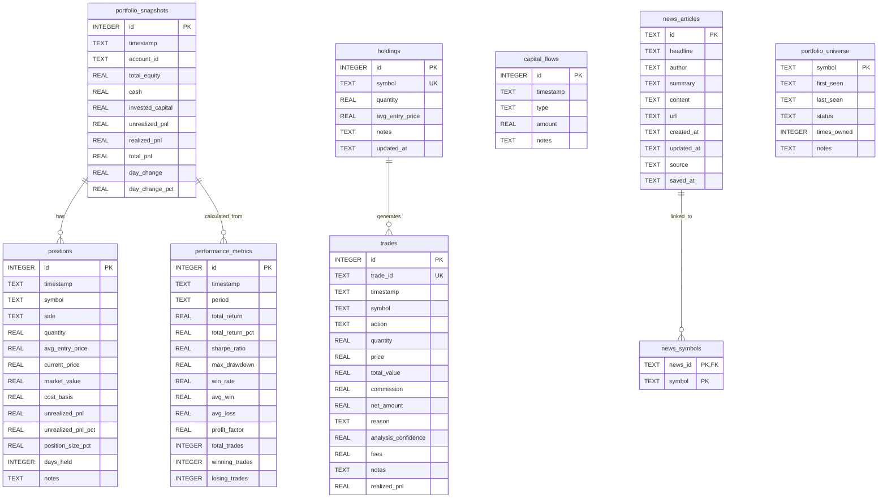

# Portfolio Database Schema Diagram

## Table Descriptions

### Core Portfolio Tables
- **portfolio_snapshots**: Daily snapshots of overall portfolio performance
- **positions**: Individual position details and performance tracking
- **trades**: Record of all buy/sell transactions
- **holdings**: Current open holdings (manual positions)
- **capital_flows**: Deposits and withdrawals
- **performance_metrics**: Calculated performance metrics by period

### News Tables
- **news_articles**: News articles fetched from Alpaca news API
- **news_symbols**: Junction table linking articles to symbols (many-to-many)

### Universe Tracking
- **portfolio_universe**: Tracks all symbols that have been in the portfolio

## Relationship Notes

- `portfolio_snapshots` → `positions`: Linked via timestamp and account_id
- `positions` → `trades`: Linked via symbol and timestamp
- `portfolio_snapshots` → `performance_metrics`: Metrics calculated from snapshots
- `news_articles` → `news_symbols`: Many-to-many relationship (articles can mention multiple symbols)
- `portfolio_universe`: Standalone table tracking symbol metadata
