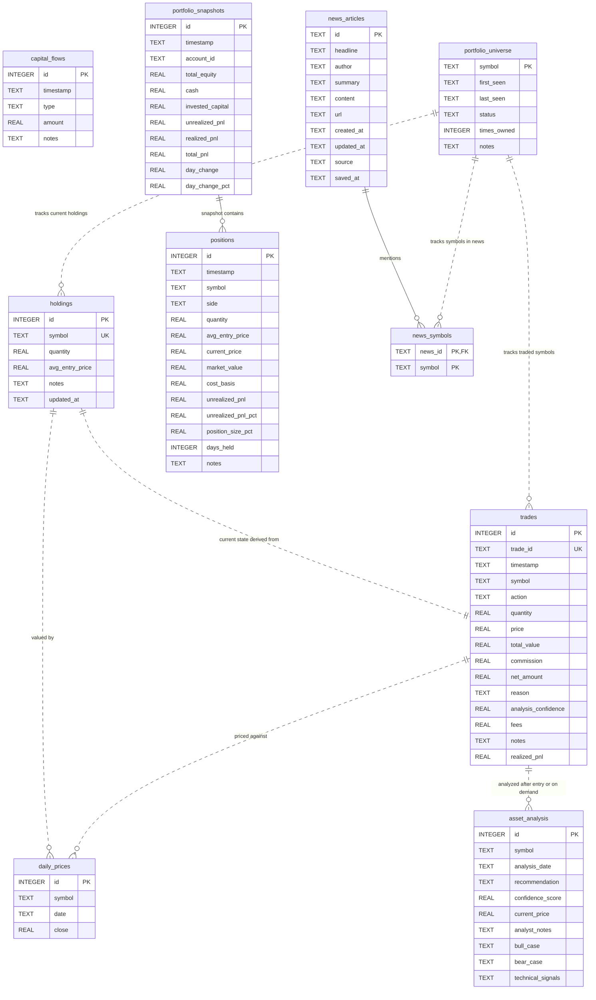

# Portfolio Database Schema

```mermaid
erDiagram
    holdings {
        INTEGER id PK
        TEXT symbol UK
        REAL quantity
        REAL avg_entry_price
        TEXT notes
        TEXT updated_at
    }

    trades {
        INTEGER id PK
        TEXT trade_id UK
        TEXT timestamp
        TEXT symbol
        TEXT action
        REAL quantity
        REAL price
        REAL total_value
        REAL commission
        REAL net_amount
        TEXT reason
        REAL analysis_confidence
        REAL fees
        TEXT notes
        REAL realized_pnl
    }

    capital_flows {
        INTEGER id PK
        TEXT timestamp
        TEXT type
        REAL amount
        TEXT notes
    }

    daily_prices {
        INTEGER id PK
        TEXT symbol
        TEXT date
        REAL close
    }

    asset_analysis {
        INTEGER id PK
        TEXT symbol
        TEXT analysis_date
        TEXT recommendation
        REAL confidence_score
        REAL current_price
        TEXT analyst_notes
        TEXT bull_case
        TEXT bear_case
        TEXT technical_signals
    }

    portfolio_snapshots {
        INTEGER id PK
        TEXT timestamp
        TEXT account_id
        REAL total_equity
        REAL cash
        REAL invested_capital
        REAL unrealized_pnl
        REAL realized_pnl
        REAL total_pnl
        REAL day_change
        REAL day_change_pct
    }

    positions {
        INTEGER id PK
        TEXT timestamp
        TEXT symbol
        TEXT side
        REAL quantity
        REAL avg_entry_price
        REAL current_price
        REAL market_value
        REAL cost_basis
        REAL unrealized_pnl
        REAL unrealized_pnl_pct
        REAL position_size_pct
        INTEGER days_held
        TEXT notes
    }

    news_articles {
        TEXT id PK
        TEXT headline
        TEXT author
        TEXT summary
        TEXT content
        TEXT url
        TEXT created_at
        TEXT updated_at
        TEXT source
        TEXT saved_at
    }

    news_symbols {
        TEXT news_id PK, FK
        TEXT symbol PK
    }

    portfolio_universe {
        TEXT symbol PK
        TEXT first_seen
        TEXT last_seen
        TEXT status
        INTEGER times_owned
        TEXT notes
    }

    holdings ||..|| trades : "current state derived from"
    holdings ||..o{ daily_prices : "valued by"
    trades ||..o{ daily_prices : "priced against"
    trades ||..o{ asset_analysis : "analyzed after entry or on demand"
    portfolio_snapshots ||--o{ positions : "snapshot contains"
    news_articles ||--o{ news_symbols : "mentions"
    portfolio_universe ||..o{ trades : "tracks traded symbols"
    portfolio_universe ||..o{ holdings : "tracks current holdings"
    portfolio_universe ||..o{ news_symbols : "tracks symbols in news"
```

## Notes

- `holdings` is the current-state table used by the dashboard and CLI for open positions.
- `trades` and `capital_flows` are the source-of-truth event tables for manual portfolio activity.
- `daily_prices` normalizes close-price history used for asset metrics, performance, and the equity curve.
- `asset_analysis` stores AI analysis results, but the frontend does not currently preload the latest cached analysis.
- `portfolio_snapshots` and `positions` are historical snapshots produced by `scripts/daily_snapshot.py`.
